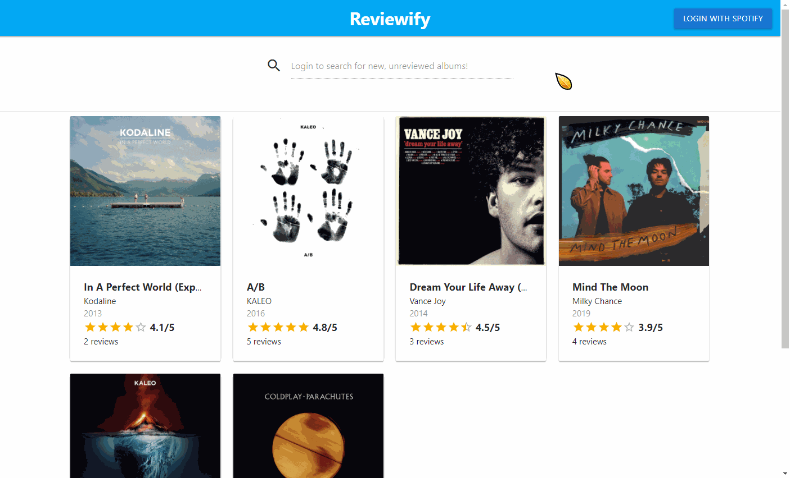
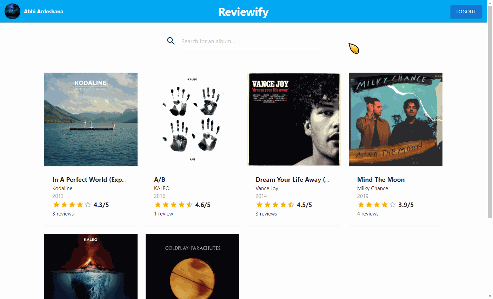

# Reviewify

## Summary
Reviewify is a review aggregator platform that leverages the Spotify Web API. It allows users to:
- Login with their Spotify accounts
- View albums that have been reviewed by other users, and see the album's average rating and number of reviews
- Create their own reviews and view reviews posted by other users
- Search for albums that have yet to be reviewed, pulling results from Spotify's album catalog

## Demo
Here are a few gifs to demonstrate the app's functionality.

### Logging in
Users can log in with their Spotify accounts via OAuth. Logging in allows users to post reviews and use the search functionality.

### Adding and Deleting Reviews
When a review is added or deleted, the album data is updated to reflect the changes in the average rating and the number of reviews. The app also ensures that users cannot review a given album more than once.

### Searching for Albums
Logged in users can search for any album via the search bar on the homepage. Results are fetched from the Spotify catalog using the Web API. Once an album has at least one review, it will show up on the homepage.
